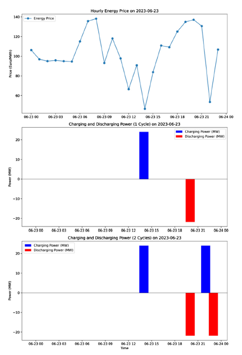
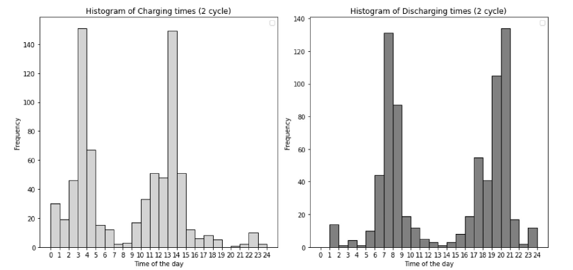

# Economic Feasibility of BESS for Electricity Arbitrage: Greek Market Case Study

### 📖 Overview
This repository presents the core methodology and financial results of the research paper **"Assessing the economic feasibility of Li-ion batteries storage systems for electricity arbitrage: A case study of the Greek energy market"**, published in *Next Research (Elsevier)*. 

The study evaluates the viability of a 24 MW / 24 MWh Lithium-Ion Battery Energy Storage System (BESS) participating in the Greek Day-Ahead Market (DAM) under the EU Target Model.

📄 **[Read the full paper here]((https://www.sciencedirect.com/science/article/pii/S3050475924001088))**

### ⚙️ Methodology & Tech Stack
To determine the optimal charging and discharging scheduling, a deterministic **Linear Programming (LP)** optimization model was developed using Python's **PuLP** library. The algorithm maximizes daily arbitrage revenue under perfect market foresight, subject to specific technical and operational constraints.

#### Mathematical Formulation (Objective Function)
The core objective is to maximize the daily revenue ($K_{day}$):
$$\max K_{day} = \sum_{t=1}^{24} (P_{d,t} \cdot T_{t} - P_{c,t} \cdot T_{t})$$
Where $P_{d,t}$ and $P_{c,t}$ represent the discharge and charge power (MW) at hour $t$, and $T_{t}$ is the DAM clearing price (€/MWh).

#### System Constraints
* **Power Limits:** $0 \le P_{d,t} \le P_{nom}$ and $0 \le P_{c,t} \le P_{nom}$ (where $P_{nom} = 24$ MW).
* **Energy Capacity:** The State of Charge (SOC) is strictly bounded by the nominal capacity ($C_{nom} = 24$ MWh).
* **Cycle Efficiency:** A round-trip efficiency ($\eta$) of 90% is applied.

### 📊 Operational Strategy
The LP model effectively identifies price spreads. The analysis of a 2-cycle per day strategy reveals a clear operational pattern:
1. **Charging:** Predominantly during the early morning (03:00-04:00) and midday (13:00-14:00) due to high PV generation lowering prices.
2. **Discharging:** Focused strictly on the evening peak hours (19:00-21:00) to capture maximum market value.

*(See dispatch profile example below)*

### 💶 Financial Results & Viability
The techno-economic assessment considers CAPEX, OPEX, degradation (battery replacement at year 10), and the current Greek state support schemes (Investment and Operational aid) over a 20-year lifetime.

While pure arbitrage revenues alone do not overcome the levelized cost of storage (LCOS), the integration of existing government support mechanisms makes the investment highly viable.

| Financial Metric | 1 Cycle / Day | 2 Cycles / Day |
| :--- | :--- | :--- |
| **Annual Profit (Arbitrage)** | €1,036,281.50 | €1,340,820.94 |
| **Net Present Value (NPV)** | €11,869,463 | €14,201,670 |
| **Internal Rate of Return (IRR)** | **26.0%** | **28.7%** |

*Note: Financials include investment aid and a 10-year operational subsidy of €115,000/MW/year[c.*
